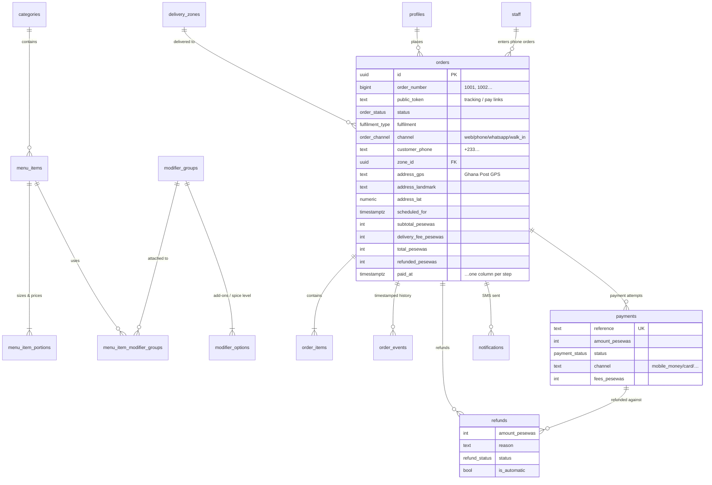
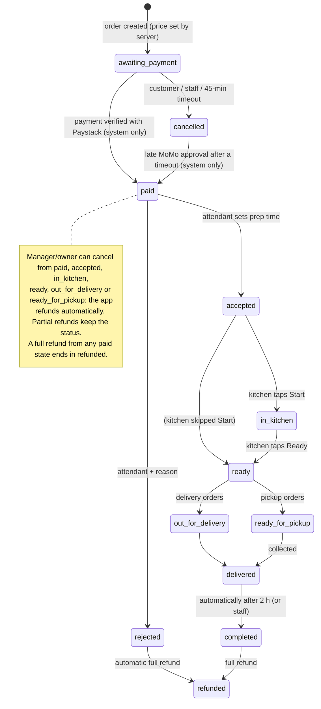

# Irie's Cuisine — Technical plan

*Prepared 1 October 2026 for the 12 October 2026 launch. Prices were checked against public sources in late September / early October 2026 (listed at the end). Confirm them when you sign up, because providers change them.*

---

## 1. Questions and assumptions

Nothing in the brief blocked the build, so there are no open questions. Two placeholders were left unfilled, and some details had to be assumed. Change any of these and tell me; most are a setting, not code.

| Topic | Assumption | Where to change it |
|---|---|---|
| Brand colours `[PASTE HEX CODES]` | A warm placeholder palette: jollof red `#9e3b22`, gold `#c9973f`, espresso `#241612`, cream `#fbf6ef`. Contrast is checked for WCAG AA. | One block at the top of `src/app/globals.css` |
| Logo | A placeholder "I" monogram for the app icons | `npm run icons -- path/to/logo.png` |
| Launch budget `[AMOUNT PER MONTH]` | Unknown. The recommended setup has a fixed cost of about **US$45 (≈ GH₵525) a month**. On top of that you pay per use for SMS and 1.95% per payment. See §2.3. | — |
| Average order value | **GH₵120** (food plus delivery). It's used only for the cost table. | — |
| Opening hours, delivery zones, prices | Sample values for Adenta and nearby areas (Madina, East Legon, Oyarifa, Spintex) | Admin → Hours & settings / Delivery zones / Menu |
| Delivery fee model | **By zone** at launch (the customer picks an area). Fees based on distance come in Phase 2. | Admin → Delivery zones |
| Staff sign-in | Email + password per person, created by the owner or a manager. Customers sign in with a phone number and a one-time code, as the brief asks. | Admin → Staff |
| Tax / VAT | Prices are shown as the final price. No VAT line is shown. | Ask your accountant; we can add a VAT line |
| Unpaid orders | Cancelled automatically after 45 minutes. If the payment then arrives late (a slow MoMo approval), the order is revived. | Admin → Hours & settings |
| Rejecting an order | Any rejection, or a cancellation after payment, **refunds the customer in full automatically** | — |

---

## 2. Recommended stack, hosting and costs

### 2.1 The stack

| Layer | Choice | Why |
|---|---|---|
| App (customer PWA, staff screens, admin) | **Next.js 16** (React 19, TypeScript, Tailwind CSS 4), one codebase | Pages are rendered on the server and served from a CDN, so the first load is fast on 3G. Shareable dish links get proper WhatsApp/Instagram previews. It's installable as a PWA. There is no app-store dependency. |
| Hosting | **Vercel Pro**, with functions pinned to **London (`lhr1`)** | Zero-ops deploys, preview links for every change, and built-in cron. Functions sit in the same city as the database. Pro is required because the free Hobby plan forbids commercial use. |
| Database, auth, realtime, file storage | **Supabase Pro**, region **West Europe (London) `eu-west-2`** | Standard Postgres (no lock-in), row-level security, phone-OTP auth with a hook for any SMS provider, realtime for the staff screens, storage for menu photos, and daily backups. |
| Payments | **Paystack** (see §2.2) | — |
| SMS | **Arkesel** (primary) and **mNotify** (automatic fallback) | Ghanaian providers at about GH₵0.022–0.031 per SMS. Twilio's international SMS rates to Ghana are much higher. Both are already wired in; you switch with one setting. |
| Error monitoring | **Sentry** (free Developer plan to start) | Already wired. It only switches on when you add the DSN. |
| Uptime alerts | **UptimeRobot** free (50 monitors, 5-minute checks; its terms allow commercial use) or Better Stack free | Point it at `/api/health` |

**Why London?** Supabase has no African region. West African internet traffic mostly reaches the world through submarine cables landing in Europe (Portugal/UK), so London or Paris gives the lowest round-trip from Accra, roughly 90–130 ms. Cape Town is often slower because traffic is frequently routed via Europe anyway. Static files (pages, images, JavaScript) are served from the CDN's nearest edge, and the service worker caches them on the phone after the first visit.

**Avoiding lock-in cheaply:**
- The database is plain Postgres, and the full schema is in `supabase/migrations`.
- Next.js also runs on Netlify, Cloudflare (via OpenNext), or any Node server.
- The payment gateway and the SMS provider are each isolated in one file (`src/lib/server/paystack.ts`, `src/lib/server/sms.ts`).

### 2.2 Payment gateways compared

| | **Paystack** | Hubtel | Flutterwave |
|---|---|---|---|
| Local Mobile Money (MTN, Telecel, AT) | **1.95%** | 1.95% MTN/Telecel, 2.5% AT, min GH₵0.30 | 1.85% MTN/AT, 2.2% Telecel |
| Ghana-issued Visa/Mastercard | **1.95%** | 2.90%, min GH₵0.50 | 2.6% |
| International cards | Confirm at signup (published as 1.95% on the Ghana pricing page at the time of writing) | 3.5% | 4.8% |
| Settlement | Next business day (T+1) to a bank or MoMo wallet (GH₵1 MoMo payout fee). "Manual payouts" can pay out on weekends. | Into your Hubtel balance **within the hour, including weekends**. Bank transfer T+1 to T+3. | Not verified for this plan |
| MoMo checkout | Hosted checkout handles MTN/Telecel/AT prompts and vouchers | Strong (Ghana-native) | Available |
| Refunds | Full and partial via API, with refund webhooks | Hubtel keeps its fee on refunded payments | Via API |
| API quality | Excellent docs, test mode, signed webhooks (HMAC-SHA512), a transaction-verify endpoint, payment pages. Owned by Stripe. | Good; Ghana-focused ecosystem (POS, SMS) | Broad, multi-country |

**Recommendation: Paystack.**
- It charges the same 1.95% whether a customer pays by MoMo or card. Card payers cost 1.95% instead of 2.9% with Hubtel.
- It has the cleanest API, test mode and webhook model. That makes "never trust the client" easy to get right.
- Partial refunds work over the API.

Its weakness is next-business-day settlement. If weekend cash flow matters, use Paystack's manual payouts. Keep **Hubtel as plan B**: adding a Hubtel adapter is about 1–2 days of work, because the gateway sits behind one module.

Paystack activation needs business documents (TIN, Registrar-General certificate, and a bank/MoMo account in the business name) and takes "a few business days". **This is the critical path for 12 October. Submit it on 2 October.**

### 2.3 Estimated monthly cost

Assumptions:
- 30-day months, average order GH₵120, US$1 ≈ GH₵11.7.
- About 3.5 SMS per order: sign-in codes plus "paid", "confirmed" and "on its way / ready".

| | **~30 orders/day** | **~300 orders/day** | **~3,000 orders/day** |
|---|---|---|---|
| Orders per month | 900 | 9,000 | 90,000 |
| Sales (GMV) | GH₵108,000 | GH₵1,080,000 | GH₵10,800,000 |
| **Paystack (1.95%)** | **GH₵2,106** | **GH₵21,060** | **GH₵210,600** (negotiate a custom rate at this volume) |
| SMS (Arkesel bulk tiers) | ~3,150 SMS → **GH₵100** | ~31,500 → **GH₵790** | ~315,000 → **GH₵6,900** |
| Vercel Pro | $20 | $20 | $20–60 |
| Supabase Pro (+ bigger database server as you grow) | $25 | $25–30 | $75 (Medium compute); add $100 for point-in-time recovery if wanted |
| Sentry | $0 | $0 | $26 (Team) |
| Uptime monitoring | $0 | $0 | $0 |
| Email receipts (Phase 2, Resend) | $0 (free tier) | ~$20 | ~$35–90 |
| Domain (~$15–20/year) | ~$2 | ~$2 | ~$2 |
| **Platform subtotal** | **≈ $47 ≈ GH₵550** | **≈ $67–72 ≈ GH₵790–840** | **≈ $160–255 ≈ GH₵1,900–3,000** |
| **Total per month** | **≈ GH₵2,760** (2.6% of sales) | **≈ GH₵22,700** (2.1%) | **≈ GH₵219,000–220,500** (2.0%) |
| …of which not payment fees | ≈ GH₵650 | ≈ GH₵1,600 | ≈ GH₵8,800–9,900 |

What this means:
- **Payment fees are 75–95% of the running cost.** The software platform itself is cheap at every size.
- Price your menu with the 1.95% in mind. Paystack can pass the fee on to the customer, but that tends to hurt conversion.
- **SMS is cheaper than WhatsApp for automated updates in Ghana.** WhatsApp utility templates cost about US$0.004–0.005 (≈ GH₵0.05) each. Since 1 October 2026, Meta also charges for service messages after 1,000 free per month. SMS costs GH₵0.022–0.031. Use SMS for automated order updates and free WhatsApp click-to-chat for human support (both are built in). Phase 2 can add WhatsApp notifications for customers who prefer them.
- **Cheaper hosting option:** Cloudflare Workers ($5/month) via OpenNext instead of Vercel Pro saves about $15/month, but takes more setup. It's worth it later, not before launch.
- **Don't** run production on Supabase's free plan. It pauses after a week of inactivity and has no backups.

---

## 3. Architecture and database

### 3.1 Architecture

```mermaid
flowchart LR
  subgraph People
    C["Customer PWA<br/>(Android / iPhone browser)"]
    A["Attendant console<br/>(tablet / phone)"]
    K["Kitchen display<br/>(tablet)"]
    M["Admin & reports<br/>(manager / owner)"]
  end
  subgraph Vercel["Vercel — CDN edge + functions in London (lhr1)"]
    N["Next.js 16 app<br/>pages + API routes"]
    CR["Cron every 5 min<br/>/api/cron"]
  end
  subgraph Supabase["Supabase — London (eu-west-2)"]
    DB[("Postgres<br/>RLS + order state machine")]
    AU["Auth<br/>phone OTP · staff email"]
    RT["Realtime"]
    ST["Storage<br/>menu photos"]
  end
  P["Paystack<br/>MoMo · cards"]
  S["Arkesel / mNotify<br/>SMS"]

  C -->|HTTPS| N
  A -->|HTTPS| N
  K -->|HTTPS| N
  M -->|HTTPS| N
  C -.->|menu, tracking (read-only, RLS)| DB
  A -.->|live orders (websocket)| RT
  K -.->|live tickets (websocket)| RT
  RT --- DB
  N -->|server key: create order, confirm payment, refund| DB
  N -->|initialize · verify · refund| P
  P -->|signed webhook| N
  AU -->|Send-SMS hook (signed)| N
  N --> S
  CR --> N
  M -->|photo upload| ST
```

How the pieces divide the work:
- **The browser never decides anything that matters.** It sends dish, portion and option IDs. The server prices them from the database, checks every rule, and creates the order.
- **The database enforces the rules.**
  - Status changes go through one function. It checks the caller's role against a transitions table, locks the order row, and timestamps every step in `order_events`.
  - Payment confirmation and refunds are database functions that run inside transactions.
  - Row-level security means a customer can only ever read their own orders, and staff can only do what their role allows.
- **Staff screens are realtime with a safety net.** They receive changes over a websocket. They reload everything after a reconnect, poll every 30 seconds while connected and every 8 seconds while offline, and show a clear "Offline — reconnecting" banner. Status buttons retry once and are idempotent, so a double tap on bad Wi-Fi is harmless.

### 3.2 Database schema

All money is stored as **integer pesewas** (GH₵1.00 = 100). Timestamps are stored in UTC and shown in Africa/Accra time.



| Table | Purpose |
|---|---|
| `store_settings` (one row) | Pause switch, delivery/pickup on/off, prep-time default, scheduling rules, payment timeout, pickup address, support numbers |
| `opening_hours`, `closed_dates` | Weekly hours (split shifts allowed) and holidays |
| `delivery_zones` | Name, areas, fee, minimum order, ride time, active |
| `categories`, `menu_items`, `menu_item_portions` | Menu. `is_available = false` means **sold out** (still listed); `is_active = false` means hidden |
| `modifier_groups`, `modifier_options`, `menu_item_modifier_groups` | Add-ons, sides and **spice level** (a required "choose 1" group), with min/max choices and prices |
| `profiles` | Customer: verified phone, name, optional email, **marketing consent + timestamp**, default address |
| `staff` | Role: `attendant`, `kitchen`, `dispatcher`, `manager`, `owner`; active flag |
| `orders`, `order_items` | Orders with price snapshots (later menu changes never alter history) |
| `order_events` | Every status change: from, to, who, role, note, time |
| `order_status_transitions` | **The state machine as data** (see §4) |
| `payments` | One row per payment attempt, with a unique reference, gateway status, channel and fees |
| `refunds` | Full and partial refunds with reason, requester, automatic flag and gateway status |
| `webhook_events` | Every gateway callback (for de-duplication and investigation) |
| `notifications` | Every SMS, unique per order and type, so a customer never gets the same text twice |
| `audit_log` | Price changes, delivery-fee changes, refunds, rejections, cancellations, staff and settings changes, payment anomalies |
| `rate_limits` | Abuse protection (checkout, OTP, payment links, catering form) |
| `catering_enquiries` | The catering form, with status `new → contacted → quoted → won/lost` |

Reporting functions:
- `sales_summary(from, to)` returns revenue/orders by day and hour, AOV, top and bottom dishes, sales by payment method, zone and channel, average accept/prep/delivery times, rejection/cancellation/refund rates and repeat customers.
- `customer_list()` returns each customer with their consent status.

---

## 4. Order state machine and payment flow

### 4.1 States



The rules live in the `order_status_transitions` table. `transition_order()` refuses anything not listed there, and it looks up the caller's role in the database, never from the browser. Key rules:
- **Only the server can mark an order paid or refunded.**
- **Kitchen staff cannot accept or reject.**
- **Only managers and the owner can cancel after payment.**
- **Rejecting or cancelling requires a reason.**

The guards also stop:
- sending a pickup order "out for delivery";
- reviving an order the *customer* cancelled;
- marking an order refunded when it was never paid.

Repeating the same transition is a harmless no-op. A unit test checks that the screens' copy of these rules matches the database exactly.

### 4.2 Payment flow

```mermaid
sequenceDiagram
  autonumber
  participant C as Customer (phone)
  participant App as Irie's server
  participant DB as Postgres
  participant PS as Paystack
  C->>App: Pay (dish IDs, zone, address, time)
  App->>DB: price from DB, check rules, create_order() → awaiting_payment
  App->>DB: insert payment (unique reference)
  App->>PS: initialize transaction (amount, reference, callback = tracking link)
  PS-->>C: hosted checkout (MoMo prompt / card)
  C->>PS: approves MoMo prompt / pays by card
  PS->>App: webhook charge.success (signed HMAC-SHA512)
  App->>App: verify signature; drop exact duplicates
  App->>PS: GET /transaction/verify/:reference (never trust the webhook alone)
  App->>DB: confirm_payment(): lock row, check amount + currency, mark paid
  DB-->>App: paid | already_processed | needs_refund | amount_mismatch
  App-->>C: SMS "payment received" + tracking link
  PS-->>C: redirect back to tracking page
  C->>App: tracking page asks server to verify now (same idempotent path)
  Note over App,DB: Every 5 minutes the cron re-verifies open payments<br/>(missed webhooks, slow MoMo approvals) and expires unpaid orders.
```

How each edge case is handled:

| Situation | What happens |
|---|---|
| **Forged or early webhook** | Ignored unless the HMAC signature matches. Even then, the order is only marked paid after Paystack's verify API confirms `success` for the **exact amount and currency** we asked for. (The end-to-end test sends a correctly signed "success" for a payment that was still pending, and the order stays unpaid.) |
| **Duplicate callbacks** (webhook retries, the customer's redirect and the cron all at once) | Exact duplicate deliveries are dropped. `confirm_payment()` locks the payment row, and a second call returns `already_processed`. One "paid" event and one SMS, guaranteed by unique constraints. |
| **MoMo still pending** (prompt not yet approved, network delay) | Payment recorded as `pending`. The order stays "awaiting payment". The tracking page polls every 4 seconds and says "approve the prompt on your phone". The cron re-checks every 5 minutes. The timeout is extended by 15 minutes while a payment is pending. |
| **Failed / abandoned payment** | Recorded; the order stays payable. "Pay now" re-uses the open checkout for 20 minutes, then starts a fresh attempt with a new reference. Unpaid orders are cancelled after 45 minutes (configurable), and the customer has not been charged. |
| **Approved after the timeout** | The order is revived to Paid (it's real money) and the alarm rings for the attendant, who can still reject (with automatic refund). |
| **Paid twice** (two attempts both succeeded) | The second payment is **refunded automatically**. The order is unaffected. |
| **Paid after the customer cancelled** | Refunded automatically |
| **Amount/currency mismatch** | Never accepted. It's flagged in the audit log, in Sentry, and on the dashboard ("Needs attention"). |
| **Refunds** | Two steps, so double clicks can't double-refund: (1) `reserve_refund()` checks the remaining refundable amount under a row lock; (2) the server calls Paystack; (3) `finalize_refund()` records the answer. If Paystack refuses, the reservation is released and the manager sees "Retry refund". Refund webhooks and the cron keep each refund's status up to date. A full refund sets the order to Refunded; a partial one keeps the status and texts the customer. |
| **Card data** | Never touches our servers. Paystack hosts the checkout (PCI DSS is Paystack's responsibility). |
| **Phone/WhatsApp orders** | The attendant enters the order; the customer gets a permanent link `/pay/<token>` by SMS and/or WhatsApp. It creates a fresh checkout whenever opened. There is still no cash: the kitchen only sees the order once it's paid. |

---

## 5. Roadmap, and what's honestly achievable by 12 October 2026

Today is Thursday 1 October. Launch is Monday 12 October: **11 days, of which 7 are working days.**

### 5.1 Phase 1 (launch MVP): built and tested now

Everything in the brief's Phase 1 is built, plus several items pulled forward because they were cheap and reduce launch risk:

- **Customer PWA**
  - Menu by category with photos, portions, add-ons and spice level; live "sold out"; search; cart; order and item notes.
  - Delivery by zone (fee + minimum order) or pickup. Address by Ghana Post GPS, landmark and directions, plus **"pin my current location"** (GPS).
  - Opening hours enforced; **scheduling for later** (time slots).
  - **Phone + OTP sign-in** (via a Ghanaian SMS provider).
  - Prepaid checkout; **live tracking page** with ETA and timeline; **SMS status updates**.
  - Order history and one-tap reorder; printable digital receipt.
  - **Catering enquiry form** (sent to management by SMS).
  - WhatsApp support button.
  - Installable app, offline page, SEO and shareable dish links with previews.
- **Payments**
  - Paystack (MoMo, cards, bank where enabled).
  - Signed webhooks with re-verification, pending/failed/duplicate handling, automatic refunds.
  - Manager full and partial refunds with reasons.
  - **Payment links for phone and WhatsApp orders.**
- **Attendant console**
  - Loud repeating alarm, flashing tab title and screen kept awake.
  - Accept with prep time, or reject with reason (auto-refund).
  - Call or WhatsApp the customer.
  - Phone/WhatsApp/walk-in order entry; sold-out toggles.
  - "Send out" with rider name/phone, plus a **WhatsApp button that sends the rider the address and map link**.
  - Print an 80 mm ticket.
- **Kitchen display:** dark, large tickets; elapsed timers turning green → amber → red against the prep estimate; Start / Ready; scheduled tickets held back until it's time; ticket printing.
- **Admin**
  - Menu, photos (auto-shrunk for 3G), portions, add-ons; hours, holidays, zones and settings, including a **pause-orders switch**.
  - Staff accounts and roles.
  - Order search with full timeline and refunds.
  - **Audit log**.
  - **Sales dashboard**: by day/hour/payment method/zone/channel; AOV; top and slowest dishes; prep, accept and delivery times; cancellation and refund rates; repeat customers.
  - **CSV exports**: orders, items, payments (for reconciliation) and customers with consent.
  - Customer list with consent; catering inbox.
- **Operations**
  - A cron every 5 minutes: re-checks payments, expires unpaid orders, completes delivered orders, tracks refunds.
  - **An SMS to managers if a paid order waits more than 5 minutes unaccepted.**
  - Health endpoint for uptime monitoring; Sentry.

**Tests:**
- 85 database checks: state machine, payments, refunds, row-level security, reporting.
- 58 unit tests: pricing, hours/slots, Ghana phone & GPS formats, webhook signatures, SMS length and cost, CSV safety, and the UI/database state-machine match.
- 45 end-to-end checks against the real build: checkout → webhook → kitchen → refunds → phone order → exports → cron → OTP.

### 5.2 Is 12 October achievable?

**The software is ready for 12 October. What's not ready is everything outside the code**, and some of it depends on third parties. In order of risk:

1. **Paystack business activation.** It needs your TIN, Registrar-General certificate and a business bank/MoMo account in the same name. Usually a few business days; mismatched names cause rejections. *Submit on Friday 2 October.*
2. **SMS sender ID approval.** Mobile networks approve it in a few business days. *Fallback:* send OTPs and updates from the provider's default sender ID until "IriesFood" (or your choice) is approved.
3. **Menu content.** Final prices, descriptions and especially **good photos**. *Fallback:* launch with the branded placeholders and add photos one dish at a time; it never blocks ordering.
4. **Devices and people.** A 10-inch Android tablet for the kitchen; a phone or tablet for the attendant (each with data/Wi-Fi as backup); an optional 80 mm thermal printer. Two training sessions and a dry run.
5. **Legal.**
   - Have the privacy policy and terms templates reviewed.
   - **Register Irie's Cuisine as a data controller with the Data Protection Commission** (Act 843).
   - Note that data is hosted in the UK. The privacy policy discloses this.

Day-by-day plan: [`LAUNCH_CHECKLIST.md`](./LAUNCH_CHECKLIST.md).

**If Paystack is not activated by Friday 9 October:** don't go live with workarounds that break the "prepaid, confirmed server-side" rule. Either:
- **(a)** soft-launch on 12 October to a small invited group as soon as activation lands; or
- **(b)** I add a Hubtel adapter (1–2 days) if Hubtel activates faster for you.

I'd advise against taking MoMo transfers to a personal number with manual confirmation. It's exactly the unreconciled, fraud-prone flow this system exists to avoid.

### 5.3 Phase 2: about 4–6 weeks after launch (target late November 2026)

| Feature | Launch-day fallback (already built) |
|---|---|
| **Dispatcher/rider app**: assign riders, rider's own job list, mark delivered with the customer's 4-digit code | Attendant sets rider name/phone and taps "Send out". A WhatsApp button sends the rider the address and map link. The code is already shown to the customer. |
| **Live rider GPS on a map** | Status timeline + SMS + rider's phone number on the tracking page |
| **Map pin picker and distance-based fees** (Google Maps or Mapbox) | Zones + "pin my current location" + Ghana Post GPS + landmark |
| **WhatsApp Business notifications** (optional, for customers who prefer them) | SMS (cheaper); WhatsApp click-to-chat for humans |
| **Promo codes** | None at launch (the `discount_pesewas` column and totals logic already exist) |
| **Automated payment reconciliation** (match Paystack settlements to orders, flag mismatches) | Daily: Admin → Export "Payments" vs Paystack dashboard export; the dashboard already flags amount mismatches and failed refunds |
| **Email receipts** (Resend) | Receipt page with "Print / save PDF" |

### 5.4 Phase 3: December 2026 to February 2027

| Feature | Until then |
|---|---|
| Loyalty (points or stamps, referral codes) | Customer list + consent export for manual promotions |
| Post-delivery ratings and feedback | WhatsApp button on the tracking page |
| Catering pipeline (quotes, deposits through payment links, event calendar) | Enquiry form + admin inbox with status + SMS alert |
| Accounting sync (e.g. Odoo: invoices, payments, fees) | CSV exports with stable, accountant-friendly columns |
| Advanced analytics (cohorts, item margins, prep-time heatmaps, forecasting) | Sales dashboard |
| Hardening: strict Content-Security-Policy, Supabase point-in-time recovery, load testing before big promotions | — |

---

## Sources (prices and facts checked for this plan)

- Paystack Ghana pricing and settlement: [support.paystack.com/en/articles/2130306](https://support.paystack.com/en/articles/2130306), [support.paystack.com/en/articles/2131842](https://support.paystack.com/en/articles/2131842), [mctaba.com Paystack settlement timelines](https://www.mctaba.com/learn/paystack/paystack-settlement-timelines-and-what-engineers-should-assume), [utopiagroup.io online payments Ghana](https://utopiagroup.io/resources/online-payments-ghana/)
- Paystack refunds, webhooks, IPs, activation: [paystack.com/docs/payments/refunds](https://paystack.com/docs/payments/refunds/), [paystack.com/docs/payments/webhooks](https://paystack.com/docs/payments/webhooks/), [support.paystack.com/en/articles/2130946](https://support.paystack.com/en/articles/2130946), [support.paystack.com/en/articles/2123842](https://support.paystack.com/en/articles/2123842)
- Hubtel fees and settlement: [jbklutse.com Hubtel review 2026](https://www.jbklutse.com/hubtel-review-ghana/), [news.hubtel.com settlement times](https://news.hubtel.com/hubtel-settlement-times-explained-how-fast-your-payments-get-to-you/)
- Flutterwave Ghana: [flutterwave.com/gh/pricing](https://flutterwave.com/gh/pricing)
- SMS: [arkesel.com/pricing](https://arkesel.com/pricing/), [mnotifybms.com/pricing](https://mnotifybms.com/pricing/), [arkesel.com sender ID guide](https://arkesel.com/how-to-send-bulk-sms-with-your-sender-id/)
- WhatsApp pricing changes from 1 Oct 2026: [courier.com](https://www.courier.com/blog/whatsapp-pricing-changes-october-2026), [support.wati.io](https://support.wati.io/en/articles/16954666-whatsapp-business-platform-api-pricing-changes-service-messages-and-click-to-message-ads), [engagelab.com rates](https://www.engagelab.com/blog/whatsapp-business-api-pricing)
- Supabase: [regions](https://supabase.com/docs/guides/platform/regions), [pricing breakdown](https://flexprice.io/blog/supabase-pricing-breakdown), [auth hooks (Send SMS)](https://supabase.com/docs/guides/auth/auth-hooks)
- Vercel / Netlify / Cloudflare: [Vercel pricing 2026](https://flexprice.io/blog/vercel-pricing-breakdown), [Netlify pricing 2026](https://flexprice.io/blog/complete-guide-to-netlify-pricing-and-plans), [Cloudflare Workers pricing](https://makerkit.dev/pricing-calculator/cloudflare)
- Sentry, Resend, UptimeRobot: [Sentry pricing](https://costbench.com/software/developer-tools/sentry/), [Resend pricing](https://automationatlas.io/answers/resend-pricing-explained-2026/), [UptimeRobot commercial use](https://flarewarden.com/insights/uptimerobot-free-plan-commercial-use)
- USD/GHS rate (≈ 11.67 on 30 Sep 2026): [wise.com](https://wise.com/gb/currency-converter/usd-to-ghs-rate/history)
